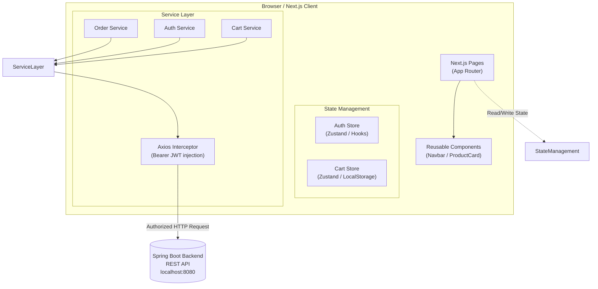
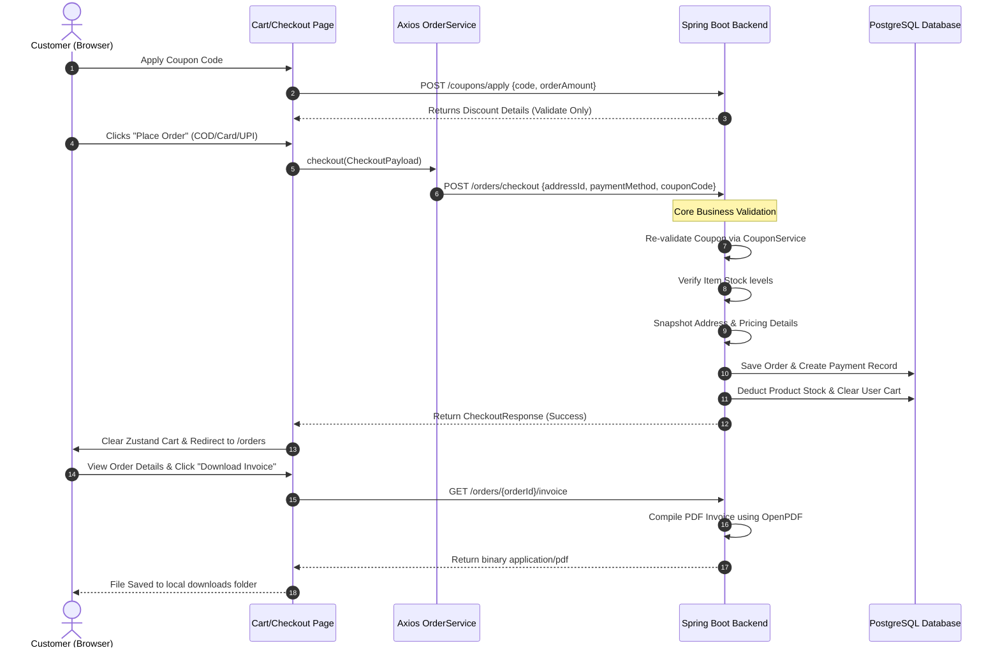

# TechHeaven— Next.js 15 E-Commerce Frontend


A production-ready e-commerce store client built with Next.js 15 App Router, TypeScript, TailwindCSS, and Zustand. Connects securely to the Spring Boot REST API.

---

## Table of Contents

- [Overview](#overview)
- [System Architecture (Frontend)](#system-architecture-frontend)
- [New Features Implemented](#new-features-implemented)
- [E-Commerce Checkout Flow Sequence](#e-commerce-checkout-flow-sequence)
- [Tech Stack](#tech-stack)
- [Getting Started](#getting-started)
- [Key Pages &amp; Directory Structure](#key-pages--directory-structure)

---

## Overview

This repository houses the user interface for Techheaven. It offers a fluid, interactive web interface focusing on performance, responsive layout, and robust state management.

- **Stateless Session Integration**: Connects with backend JWT tokens securely stored and automatically injected into outbound requests via Axios interceptors.
- **Client Side Cache**: State managed by Zustand for immediate UI responses on cart additions, coupon simulation, and profile details.
- **Premium Apple/Stripe-Like Aesthetics**: Minimalist, high-end components with responsive layouts and clean spacing.

---

## System Architecture (Frontend)



---

## New Features Implemented

1. **Transactional Checkout Payload Mapping**:
   - Updated the checkout page to correctly compile and transmit user decisions (`userId`, `addressId`, `paymentMethod`, and `couponCode`) to the backend `/orders/checkout` pipeline.
2. **Detailed Billing in Order History**:
   - Overhauled the order history list cards (`/orders`) to read and display detailed financial columns returned by the backend: Subtotal, Coupon Code, Discount amount, and Grand Total.
3. **Premium Apple/Stripe Order Details Layout**:
   - Completely redesigned `/orders/[orderId]` to feature structured, premium card layouts:
     - **Order Info (Header)**: Quick summaries with colored status badges.
     - **Shipping Details**: Name, phone, and snapshot formatted address.
     - **Products Table**: Displays quantity, price, image frame, and line-item subtotals.
     - **Financial Summary**: Shows full breakdowns (Subtotal, Coupon Code, Discount, Free Shipping, and Grand Total).
     - **Payment details**: Lists Method, Status, and Transaction ID.
4. **Authorized PDF Invoice Downloading**:
   - Configured a "Download Invoice" action that fetches the invoice PDF as a secure binary blob using `axiosClient` (carrying the user's JWT) and downloads it locally via a programmatic browser trigger.

---

## E-Commerce Checkout Flow Sequence



---

## Tech Stack

- **Core**: Next.js 15, React 19, TypeScript
- **Styling**: TailwindCSS
- **State Management**: Zustand
- **HTTP Client**: Axios (with custom Bearer Token interceptor)
- **Notifications**: React-Toastify

---

## Getting Started

### Prerequisites

- Node.js 18.x or above
- Local running backend API (defaulting to `http://localhost:8080`)

### Installation & Execution

1. Clone the repository and navigate into it:
   ```bash
   cd ecommerce-store
   ```
2. Install npm dependencies:
   ```bash
   npm install
   ```
3. Set the environment file (create `.env.local` if needed, containing the backend URI):
   ```
   NEXT_PUBLIC_API_URL=http://localhost:8080
   ```
4. Fire up the development environment:
   ```bash
   npm run dev
   ```
5. Open browser at: `http://localhost:3000`

---

## Key Pages & Directory Structure

```
src/
├── app/                     # App Router Pages
│   ├── cart/                # Shopping Cart Page
│   ├── checkout/            # Checkout form & address selector
│   ├── dashboard/           # Customer Admin dashboard
│   ├── login/               # Sign in page
│   ├── signup/              # Register account page
│   ├── orders/              # Orders History List view
│   └── orders/[orderId]/    # Redesigned Premium Details & Download page
├── components/              # Shared layouts and components (Navbar, ProtectedRoute)
├── services/                # Axios Client and Service Layer API requests
├── stores/                  # Zustand state stores (Cart, Auth)
└── types/                   # Shared TypeScript interface definitions
```
